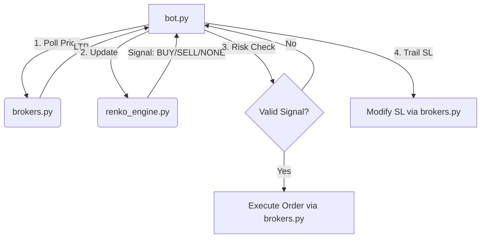

# AI Reference: Delta Exchange Renko Bot

This document provides a comprehensive overview of the **Delta working bot** codebase for AI assistants and developers.

## 1. System Overview
The bot is a trend-following trading system designed for **Delta Exchange India**. It uses **Renko bricks** to filter market noise and a **Stepline mechanism** to identify trend reversals.

- **Primary Asset**: Crypto (BTC, ETH, SOL)
- **Timeframe**: Price-action based (polls every 5 minutes by default)
- **Execution**: Live trading on Delta Exchange via REST API.
- **Risk Management**: Trailing Stop Loss (TSL) based on Renko bricks, Daily Loss Guard, and Max Trades per Day limit.

## 2. Architecture & Logic Flow



### Core Logic:
1.  **Renko Brick Building**: `renko_engine.py` builds bricks of fixed size (percent or points).
2.  **Stepline Machine**: A "Stepline" tracks the price. If price moves against the trend by a defined threshold (the `stepline_value`), it "flips," emitting a BUY or SELL signal.
3.  **Filters**:
    -   `min_bricks`: Trend must be at least X bricks long to trigger.
    -   `chop_cooldown`: Prevents rapid flips in sideways markets.
4.  **Trailing SL**: The SL is set `trail_bricks` away from the current trend's high/low.

## 3. Key Components

### [bot.py](file:///c:/trading/completed%20bots/Delta%20working%20bot/bot.py)
The orchestrator.
-   `RenkoBot.run()`: Main loop polling prices and calling `_tick()`.
-   `_tick()`: Handles daily loss checks, engine updates, and signal execution.
-   `_trail_sl()`: Calculates and updates the stop loss as price moves in favor.

### [renko_engine.py](file:///c:/trading/completed%20bots/Delta%20working%20bot/renko_engine.py)
The strategy brain (Broker-agnostic).
-   `RenkoEngine`: Manages brick generation and stepline state.
-   `trail_sl()`: Logic for calculating the SL level based on brick size.
-   `Direction` & `Signal`: Enums for system states.

### [brokers.py](file:///c:/trading/completed%20bots/Delta%20working%20bot/brokers.py)
Connectivity layer.
-   `DeltaBroker`: Implements `get_ltp`, `place_order`, `modify_sl`, and `get_pnl`.
-   **Note**: `modify_sl` works by canceling the old SL and placing a new one (Delta REST limitation).

### [config.py](file:///c:/trading/completed%20bots/Delta%20working%20bot/config.py)
Centralized configuration.
-   `SYMBOL_CONFIGS`: Contains backtested parameters for BTC, ETH, and SOL.
-   `C`: The resolved active configuration object.

### [backtest.py](file:///c:/trading/completed%20bots/Delta%20working%20bot/backtest.py)
Standalone backtesting utility.
-   Simulates the exact `RenkoEngine` logic on CSV data.
-   Outputs win rates, R:R, and TradingView-compatible CSVs.

## 4. Operational Guide

### Configuration
Update `config.py` with:
1.  `INSTRUMENT`: Target symbol (e.g., "BTC").
2.  `DELTA_API_KEY` & `DELTA_API_SECRET`.
3.  `DELTA_TESTNET`: `True` for testing, `False` for live.

### Running the Bot
```powershell
cd "c:\trading\completed bots\Delta working bot"
python bot.py
```

### Backtesting
```powershell
python backtest.py --csv path\to\data.csv --brick 0.1 --stepline 300
```

## 5. Historical Data & Backtest Results
The `historical_data/` directory contains price data and pre-run backtest results for evaluation.

- **Datasets**: 5-minute OHLCV data from yfinance (approx. 59 days).
    - `BTC-USD_yfinance_5min_59d.csv`
    - `ETH-USD_yfinance_5min_59d.csv`
    - `SOL-USD_yfinance_2min_59d.csv`
- **Backtest Outputs**:
    - `*_trades_bt.csv`: Detailed trade-by-trade logs (Entry/Exit, PnL, Equity).
    - `*_tradingview_bt.csv`: Formatted for import into TradingView.
- **Reference Parameters**:
    - **BTC**: Brick 0.1%, Stepline 300 pts.
    - **ETH**: Brick 0.1%, Stepline 0.8%.

## 6. Critical Technical Details
-   **Rounding**: Delta Exchange requires prices to be rounded (usually 1-2 decimals). `brokers.py` handles this.
-   **Reduce-Only**: SL and Close orders use `reduce_only=True` to ensure they only exit positions.
-   **Session State**: The bot is currently stateless across restarts (except for engine seeding). It does not "re-attach" to existing manual positions on startup unless they match the engine's current state.
